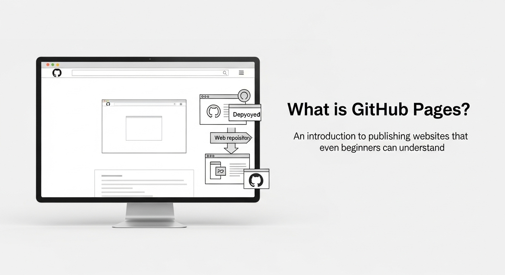
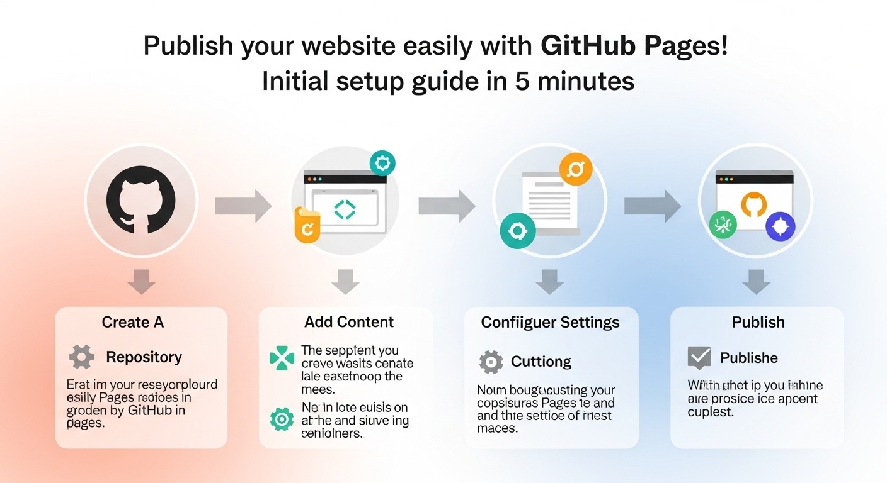
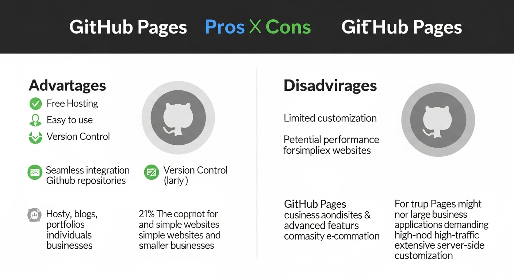

# GitHub Pages入門：5分で始めるWebサイト公開

Webサイトを作りたいけど、サーバーの契約やドメインの取得が面倒…。
そんな悩みを抱えるあなたに朗報です！
**GitHub Pages**を使えば、無料で簡単にWebサイトを公開できます。

この記事では、GitHub Pagesの基本から、初期設定、デザイン、メリット・デメリット、そしてトラブルシューティングまで、初心者でも安心してWebサイトを公開できるよう、徹底的に解説します。
さあ、あなたも今日からWebサイト公開の世界へ飛び込みましょう！

## GitHub Pagesとは？ 初心者でもわかるWebサイト公開の入門


GitHub Pagesとは、GitHubが提供する静的Webサイトホスティングサービスです。
簡単に言うと、HTML、CSS、JavaScriptなどの静的なファイルで構成されたWebサイトを、無料で公開できるサービスです。

**なぜGitHub Pagesが人気なのか？**

*   **無料:** 個人利用はもちろん、商用利用も原則無料です。（GitHub Freeプランの場合）
*   **簡単:** GitHubのリポジトリにファイルをアップロードするだけで、Webサイトが公開されます。
*   **便利:** GitHubのバージョン管理機能を利用できるため、Webサイトの更新履歴を管理できます。
*   **速い:** GitHubの高速なインフラを利用できるため、Webサイトの表示速度が速いです。
*   **カスタムドメイン:** 独自ドメインを設定することも可能です。（別途ドメイン取得費用は必要）

**GitHub Pagesでできること**

*   **ポートフォリオサイト:** 自分のスキルや作品をアピールするWebサイトを作成できます。
*   **ブログ:** Markdown形式で記事を書き、簡単にブログを公開できます。
*   **ドキュメントサイト:** プロジェクトのドキュメントやAPIリファレンスを公開できます。
*   **ランディングページ:** 製品やサービスの紹介ページを作成できます。
*   **簡単なWebアプリ:** JavaScriptを使って、簡単なWebアプリケーションを公開できます。

**GitHub Pagesの仕組み**

GitHub Pagesは、GitHubのリポジトリにあるファイルをWebサーバーに公開する仕組みです。
リポジトリには、WebサイトのコンテンツとなるHTML、CSS、JavaScriptなどのファイルを格納します。
GitHub Pagesは、これらのファイルを自動的にWebサーバーにデプロイし、Webサイトとして公開します。

**GitHub Pagesの種類**

GitHub Pagesには、大きく分けて以下の2つの種類があります。

* **User Pages:** GitHubアカウントに紐づくWebサイトです。
リポジトリ名を「`username.github.io`」とする必要があり、`https://username.github.io` というURLで公開されます。1ユーザーにつき1つだけ作成できます。
* **Project Pages:** 任意のリポジトリごとに作成できるWebサイトです。
`https://username.github.io/repository_name` というURLで公開されます。複数のプロジェクトごとに作成可能です。

どちらの種類を選ぶかは、Webサイトの用途によって異なります。個人のポートフォリオサイトやブログを作成する場合は**User Pages**、プロジェクトのドキュメントサイトや作品集を作成する場合は**Project Pages**が適しています。

## GitHub Pagesで簡単Webサイト公開！ 5分でできる初期設定ガイド


GitHub Pagesを使ってWebサイトを公開する手順は非常に簡単です。
ここでは、5分でできる初期設定ガイドとして、基本的な手順をステップバイステップで解説します。

**ステップ1：GitHubアカウントの作成**

まだGitHubアカウントを持っていない場合は、[GitHubの公式サイト](https://github.com/)にアクセスして、アカウントを作成してください。メールアドレス、ユーザー名、パスワードを入力するだけで、簡単にアカウントを作成できます。

**ステップ2：リポジトリの作成**

GitHubにログイン後、「New repository」ボタンをクリックして、新しいリポジトリを作成します。

*   **Repository name:** リポジトリ名を入力します。
User Pagesの場合は、`username.github.io`という形式で入力します。
Project Pagesの場合は、自由に名前を設定できます。
*   **Description:** リポジトリの説明を入力します。（任意）
*   **Public/Private:** リポジトリの公開範囲を選択します。
GitHub Pagesで公開する場合は、**Public**を選択する必要があります。
*   **Initialize this repository with a README:** チェックを入れておくと、READMEファイルが自動的に作成されます。

**ステップ3：Webサイトのファイルを作成**

リポジトリに、WebサイトのコンテンツとなるHTML、CSS、JavaScriptなどのファイルを作成します。最も簡単な方法は、`index.html`という名前のHTMLファイルを作成し、簡単な内容を記述することです。

```html
<!DOCTYPE html>
<html>
<head>
    <title>Hello, GitHub Pages!</title>
</head>
<body>
    <h1>Hello, GitHub Pages!</h1>
    <p>This is my first website on GitHub Pages.</p>
</body>
</html>
```
※ GitHub Pagesでは、Markdown形式の.mdファイルも自動でHTML形式に変換されます。


**ステップ4：ファイルをリポジトリにアップロード**

作成したファイルを、GitHubのリポジトリにアップロードします。

*   **GitHubのWebインターフェース:** リポジトリのページにアクセスし、「Add file」→「Upload files」をクリックして、ファイルをアップロードします。
*   **Gitコマンド:** ローカル環境でGitを使用している場合は、以下のコマンドを使ってファイルをアップロードできます。

    ```bash
    git init
    git add .
    git commit -m "Initial commit"
    git remote add origin https://github.com/username/repository_name.git
    git push -u origin main
    ```

**ステップ5：GitHub Pagesを有効化**

リポジトリの「Settings」タブをクリックし、左側のメニューから「Pages」を選択します。

*   **Source:** 「GitHub Actions」または「Deploy from a branch」を選択します。
*   **Branch:** 「Deploy from a branch」を選択した場合、公開するブランチを選択します。（通常は`main`ブランチ）
*   **/(root)** を選択されていることを確認します。

設定を保存すると、GitHub Pagesが有効化され、数分後にWebサイトが公開されます。WebサイトのURLは、`username.github.io`または`username.github.io/repository_name`となります。

**5分で初期設定完了！**

以上の手順で、GitHub Pagesを使ったWebサイトの公開が完了しました。思ったより簡単だったのではないでしょうか？次は、Webサイトのデザインやカスタマイズについて見ていきましょう。

## GitHub Pagesで差がつく！ ポートフォリオサイトのデザイン術とカスタマイズ


GitHub Pagesで公開したWebサイトを、より魅力的にするために、デザインとカスタマイズは非常に重要です。ここでは、ポートフォリオサイトを例に、デザイン術とカスタマイズのポイントを解説します。

**デザインの基本**

*   **シンプルで洗練されたデザイン:** 複雑なデザインよりも、シンプルで洗練されたデザインの方が、訪問者に好印象を与えます。
*   **レスポンシブデザイン:** スマートフォンやタブレットなど、様々なデバイスで適切に表示されるように、レスポンシブデザインを採用しましょう。
*   **統一感のあるカラースキーム:** Webサイト全体のカラースキームを統一することで、プロフェッショナルな印象を与えることができます。
*   **読みやすいフォント:** 適切なフォントを選択することで、文章が読みやすくなり、コンテンツの理解を助けます。
*   **適切な余白:** 要素間に適切な余白を設けることで、Webサイトが見やすくなり、情報が整理されます。

**ポートフォリオサイトのデザイン例**

*   **トップページ:** 自分の名前、写真、簡単な自己紹介、スキル、連絡先などを掲載します。
*   **作品紹介ページ:** 自分の作品を画像や動画で紹介します。各作品には、簡単な説明や制作過程などを記述します。
*   **ブログ:** 自分の考えや技術的な知識を発信するブログを開設します。
*   **お問い合わせページ:** 訪問者からの問い合わせを受け付けるフォームを設置します。

**カスタマイズのポイント**

*   **CSSフレームワークの利用:** BootstrapやMaterializeなどのCSSフレームワークを利用することで、簡単にデザイン性の高いWebサイトを作成できます。
*   **JavaScriptライブラリの利用:** jQueryやReactなどのJavaScriptライブラリを利用することで、Webサイトにインタラクティブな要素を追加できます。
*   **テンプレートエンジンの利用:** JekyllやHugoなどのテンプレートエンジンを利用することで、Webサイトのコンテンツを効率的に管理できます。
*   **カスタムドメインの設定:** 独自ドメインを設定することで、Webサイトの信頼性を高めることができます。

**Jekyllを使ったポートフォリオサイト作成**

**Jekyll**（ジキル）は、GitHub Pagesと相性の良い静的サイトジェネレーターです。
Jekyllを使うことで、Markdown形式で記事を書き、簡単にブログを公開できます。
また、Jekyllには、様々なテーマが用意されており、簡単にデザイン性の高いポートフォリオサイトを作成できます。

**デザインのインスピレーション**

*   **Dribbble:** デザイナーの作品を閲覧できるWebサイトです。
*   **Behance:** デザイナーのポートフォリオを閲覧できるWebサイトです。
*   **Awwwards:** デザイン性の高いWebサイトを紹介するWebサイトです。

これらのWebサイトを参考に、自分のポートフォリオサイトのデザインのインスピレーションを得ましょう。

## GitHub Pagesのメリット・デメリットを徹底比較！ 個人利用から企業利用まで


**GitHub Pages**は、無料で簡単にWebサイトを公開できる便利なサービスですが、メリットとデメリットがあります。ここでは、個人利用から企業利用まで、GitHub Pagesのメリット・デメリットを徹底的に比較します。

**メリット**

*   **無料:** 個人利用はもちろん、商用利用も原則無料です。（GitHub Freeプランの場合）
*   **簡単:** GitHubのリポジトリにファイルをアップロードするだけで、Webサイトが公開されます。
*   **バージョン管理:** GitHubのバージョン管理機能を利用できるため、Webサイトの更新履歴を管理できます。
*   **高速:** GitHubの高速なインフラを利用できるため、Webサイトの表示速度が速いです。
*   **カスタムドメイン:** 独自ドメインを設定することも可能です。（別途ドメイン取得費用は必要）
*   **HTTPS対応:** 無料でHTTPSに対応しているため、Webサイトのセキュリティを確保できます。
*   **Jekyllとの連携:** Jekyllを使うことで、Markdown形式で記事を書き、簡単にブログを公開できます。

**デメリット**

*   **静的サイトのみ:** 動的なWebサイト（データベースを使用するWebサイトなど）は公開できません。
*   **GitHubへの依存:** GitHubのサービス停止やアカウント停止などにより、Webサイトが公開できなくなる可能性があります。
*   **リポジトリの公開:** GitHubのリポジトリを公開する必要があるため、Webサイトのソースコードが公開されます。（Privateリポジトリは有料プランが必要）
*   **アクセス制限:** アクセス制限をかけることができません。（Basic認証などは可能）
*   **大規模サイトには不向き:** 大規模なWebサイトや高トラフィックのWebサイトには、性能面で不向きな場合があります。

**個人利用におけるメリット・デメリット**

*   **メリット:** 無料で簡単にポートフォリオサイトやブログを公開できるため、個人利用には最適です。
*   **デメリット:** 静的サイトのみであるため、動的なWebサイトを公開したい場合は、他のサービスを検討する必要があります。

**企業利用におけるメリット・デメリット**

*   **メリット:** 社内ドキュメントサイトやランディングページなど、静的なWebサイトを公開するのに適しています。
*   **デメリット:** 機密性の高い情報を公開する場合は、リポジトリの公開範囲に注意する必要があります。また、大規模なWebサイトや高トラフィックのWebサイトには、性能面で不向きな場合があります。

**GitHub Pagesの代替サービス**

*   **Netlify:** 静的サイトホスティングサービスとして、GitHub Pagesよりも高機能な機能を提供しています。
*   **Vercel:** フロントエンド開発に特化したプラットフォームで、Next.jsなどのフレームワークとの連携が容易です。
*   **Firebase Hosting:** Googleが提供するホスティングサービスで、無料で利用できる範囲が広いです。
*   **AWS S3:** Amazon Web Servicesが提供するストレージサービスで、静的Webサイトをホスティングできます。

これらの代替サービスも検討し、自分のニーズに合ったサービスを選択しましょう。

## GitHub Pagesトラブルシューティング：よくある質問と解決策


GitHub Pagesを利用していると、様々な問題が発生することがあります。ここでは、よくある質問とその解決策を紹介します。

**Q1. Webサイトが公開されない**

*   **原因:** GitHub Pagesの設定が間違っている、リポジトリに`index.html`ファイルがない、キャッシュの問題など。
*   **解決策:**
    *   GitHub Pagesの設定を確認し、公開するブランチが正しく選択されているか確認します。
    *   リポジトリに`index.html`ファイルがあるか確認します。
    *   ブラウザのキャッシュをクリアします。
    *   数分待ってから再度アクセスします。

**Q2. Webサイトのデザインが崩れている**

*   **原因:** CSSファイルへのパスが間違っている、CSSファイルが正しく読み込まれていない、レスポンシブデザインが正しく設定されていないなど。
*   **解決策:**
    *   HTMLファイルでCSSファイルへのパスが正しいか確認します。
    *   ブラウザの開発者ツールを使って、CSSファイルが正しく読み込まれているか確認します。
    *   レスポンシブデザインが正しく設定されているか確認します。

**Q3. カスタムドメインを設定できない**

*   **原因:** DNSレコードの設定が間違っている、ドメインの認証が完了していないなど。
*   **解決策:**
    *   DNSレコードの設定が正しいか確認します。GitHub Pagesのドキュメントに記載されている正しいDNSレコードを設定してください。
    *   ドメインの認証が完了しているか確認します。GitHub Pagesの設定画面で、ドメインの認証状況を確認できます。

**Q4. 404エラーが表示される**

*   **原因:** ファイルへのパスが間違っている、ファイルが存在しない、パーマリンクの設定が間違っているなど。
*   **解決策:**
    *   HTMLファイルでファイルへのパスが正しいか確認します。
    *   ファイルがリポジトリに存在するか確認します。
    *   Jekyllを使っている場合は、パーマリンクの設定が正しいか確認します。

**Q5. GitHub Pagesの利用制限に引っかかった**

*   **原因:** GitHub Pagesの利用規約に違反する行為を行った、リポジトリのサイズが大きすぎる、トラフィックが多すぎるなど。
*   **解決策:**
    *   GitHub Pagesの利用規約を確認し、違反する行為を行っていないか確認します。
    *   リポジトリのサイズを小さくします。不要なファイルを削除したり、画像を圧縮したりします。
    *   トラフィックを減らすために、CDNを利用したり、Webサイトの構成を見直したりします。

**トラブルシューティングのヒント**

*   **GitHub Pagesのドキュメントを読む:** GitHub Pagesのドキュメントには、様々な情報が記載されています。
*   **検索エンジンで検索する:** 自分の問題に似た事例がないか、検索エンジンで検索してみましょう。
*   **コミュニティフォーラムで質問する:** Stack Overflowなどのコミュニティフォーラムで質問してみましょう。

これらの解決策を参考に、GitHub Pagesで発生した問題を解決し、快適なWebサイト公開ライフを送りましょう！

## まとめ

この記事では、**GitHub Pages**の基本から、初期設定、デザイン、メリット・デメリット、そしてトラブルシューティングまで、幅広く解説しました。
GitHub Pagesは、無料で簡単にWebサイトを公開できる便利なサービスです。
この記事を参考に、あなたも今日からGitHub Pagesを使って、Webサイトを公開してみましょう！

この記事の内容をまとめたサンプルサイト ▻ [https://ojizou003.github.io/deploy-githubpages](https://ojizou003.github.io/deploy-githubpages/)